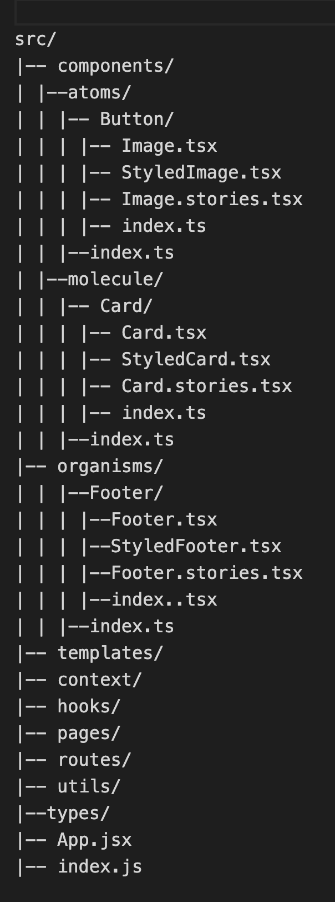

# Frontend Dev Project - Sofomo.com Website Pages

The goal of this project is to recreate the current Sofomo.com website, as a way to further develop React skills, learn animations, transitions, build a pixel perfect, responsive site and more.

Sections that are being build with this project are:

- Home
- Landing Page-Outsource
- Contact Form
- Header Navigation and Footer

## Project type

TypeScript project, bootstrapped as Create-React-App, React version: 17.0.2.

Node version v16.14.0.

Runs the app in the development mode.\
Open [http://localhost:3000](http://localhost:3000) to view it in the browser.

## Project structure approach

Project is based on Structure based on Atomic Design approach.

Structure will look similar to example below:

## Styling

Project uses StyledComponents

## Code formatting

Project has Linter and Prettier installed

## Project status

Project still in development phase.
There is a demo version of finished project, that presents final UI result, although this is not code reviewed and still requires code reformat.

### Demo version

Demo version has been deployed on Firebase, you can view it here: https://sofomowebsite-40ac6.web.app/

## Differences between project and design and project requirement

#### Design:

Project is based on provided Figma design, but I also tried to adapt to current version of Sofomo website, so there might be differences e.g in some content texts or margins.

#### State management:

There is no need to use state management solutions like suggested Zustand, it was implemented in earlier stage but removed later, as all the state can be managed inside components or by context API.

#### Styling:

I decided to make styles with Styled Components instead of suggested CSS Modules.

## External libraries used

- Styled Components,
- Framer Motion,
- Storybook,
- Formik,
- Swiper,

## What has not been implements so far, not even in demo version:

- testing
